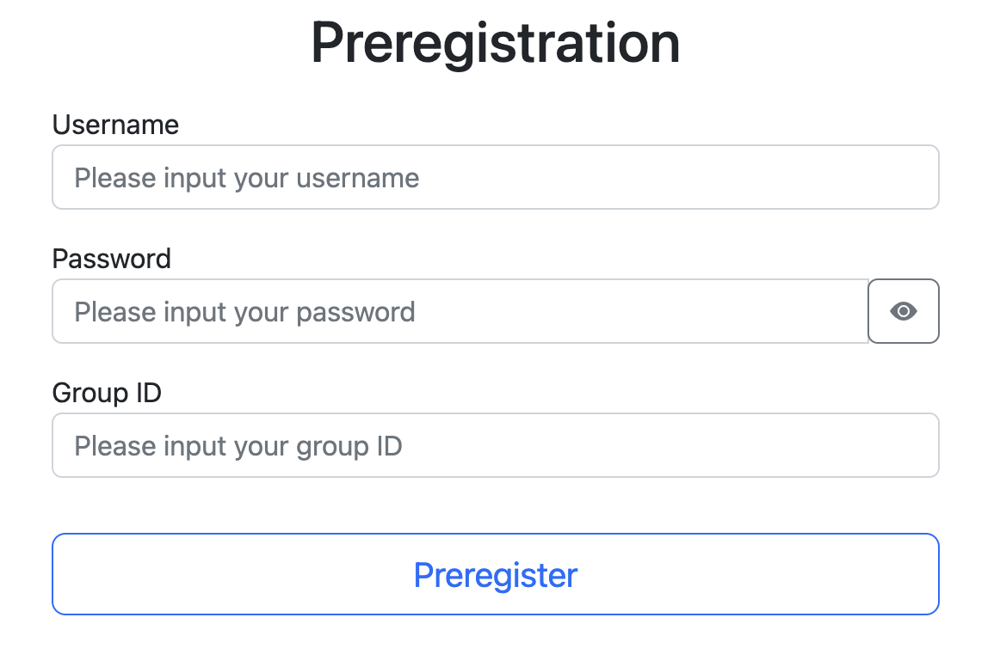
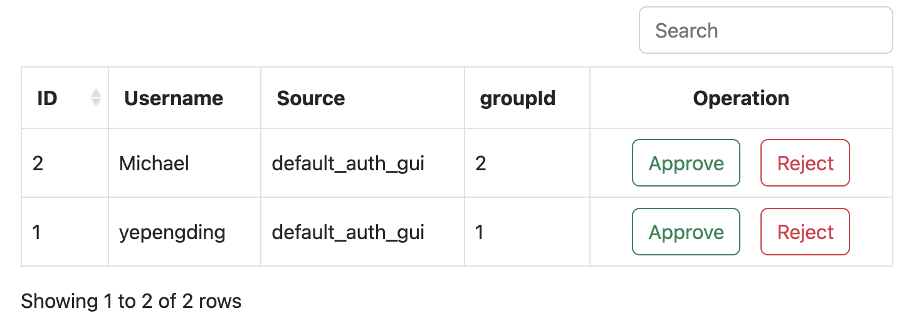
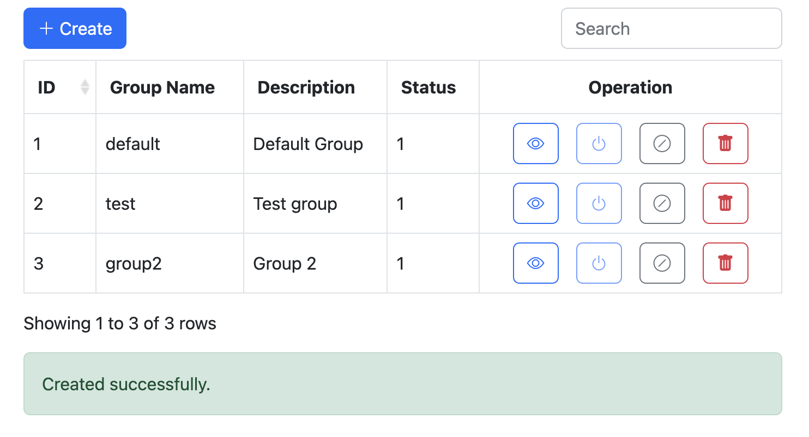

# BoostAuth

Authentication system for **Boost Plan**. The **Boost Plan** is a scaffold for building usable web applications in no
time.

BoostAuth provides a unified authentication and authorization service for all other systems provided in the Boost Plan.
It supports multiple authentication methods with a built-in administration system.

## Features

- [x] Token-based authentication and authorization
- [x] Basic access authentication ([RFC 7617](https://datatracker.ietf.org/doc/html/rfc7617))
- [x] Fully-fledged access control
- [x] Management system with frontend
- [x] Delegation support
- [x] Email service
- [x] Admin management
- [x] Group management
- [x] Role-based access control
- [x] Docker-based deployment
- [x] Clients in multiple languages (e.g., Python, JavaScript, PHP)
- [x] Integration with third-party services (e.g., Next Cloud)

## Setup

### Environment

- Java 11
- Maven 3.6+

### Configuration

> src/main/resources/application[-dev/-local/-prod].yml

### Start with Docker

```shell
docker-compose up
```

### Start with Maven

```shell
mvn clean package -D maven.test.skip=true -P [local/dev/prod]
```

## API Document

domain:9000/swagger-ui.html

## Basic Access Authentication

- Authentication endpoint: GET */basic/login*
- Header: *Authorization: Basic \<username>:\<source>:\<password>*

## Token-Based authentication

1. */token/auth/preregister*  Generate `Identity` with **UUID** and `Token`
2. */token/auth/register* Make `Identity` valid
3. */token/auth/login* Sign in
4. */token/verify* Verify a token
5. */token/auth/logout* Sign out
6. */token/auth/reset/password* Reset password

## Frontend

### User

- Preregistration: `/view/preregister`
  

### Admin

- Manage preregistration: `/admin/view/manage/preregister`
  

- Manage group: `/admin/view/manage/group`
  

---

# References

- [Spring Boot](https://spring.io/projects/spring-boot)
- [Spring Web](https://docs.spring.io/spring-framework/docs/3.2.x/spring-framework-reference/html/mvc.html)
- [Spring Data JPA](https://spring.io/projects/spring-data-jpa)
- [Spring Security](https://spring.io/projects/spring-security)
- [Spring Testing](https://docs.spring.io/spring-framework/docs/current/reference/html/testing.html)
- [Springdoc-openapi](https://springdoc.org/)
- [Thymeleaf](https://www.thymeleaf.org/)
- [Lombok](https://projectlombok.org/)
- [auth0 JWT](https://github.com/auth0/java-jwt)